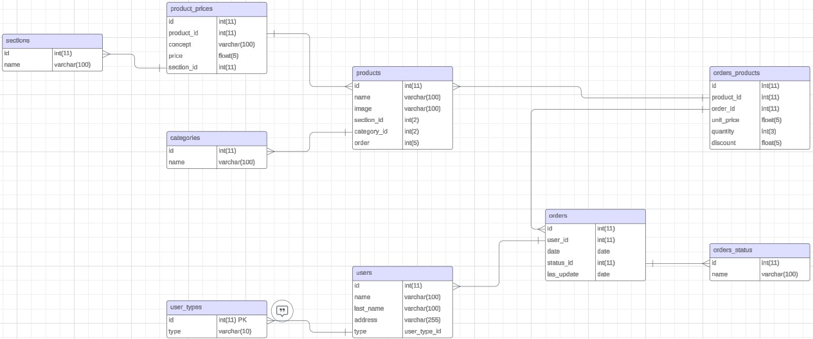

 
    
<h1>PROJECT DESCRIPTION</h1>

<h3>APP NAME: PRONTO</h3>

    
<h3>SHORT DESCRIPTION:</h3>

Streamlined E-commerce for a small Italian restaurant.

This project is intended to simplify web management for non-tech-savvy owners and managers, enabling effortless updates to products and prices. This solution amplifies online visibility, attracting new customers and fostering loyalty among existing ones.

    
<h3>LIST OF FEATURES:</h3>

1. **TECH STACK:**
    * ***MySQL database:*** Centralized storage for business information.
    * ***NodeJS API:*** using Express and Sequelize for effective communication with internal and external services or applications.
    * ***HTML Website:*** SEO-optimized platform for web presence and customer acquisition.
    * ***IONIC / Angular Web-App:*** Enhances customer loyalty and streamlines business processes.
2. **FUNCTIONALITY:**
    * ***User Management:*** Facilitates the creation, retrieval, updating, and deletion (CRUD) of users with essential details, user types (admin, employee, customer), and login credentials.
    * ***Product Management:*** Enables CRUD operations for products, incorporating categories, prices, and images. This functionality is integral for website construction and empowers customers to place orders. Integration of a camera plugin ensures seamless updating of product images.
    * ***Order Management:*** Streamlines CRUD processes for orders, encompassing vital information for users placing orders, employees tracking them, and admins generating insightful reports."

    
<h3>FUTURE FEATURES:</h3>

1. Online Payment Integration.
2. Customer point rewards and redemption in-store or online.
3. Push notifications.
4. Automatic/Scheduled Reports.
5. New customizations for the website.

    
<h3>APPLICATION USERS:</h3>

1. ***Admins:*** Full access to every feature.
2. ***Employees:*** Customer-level acces and limited management access.
3. ***Customers:*** Access limited to website navigation and own orders.

    
<h3>TYPE OF APPLICATION: WEB AND MOBILE</h3>

1. ***Website:*** HTML, SCSS and Bootstrap to improve SEO.
2. ***Ionic / Angular:*** Cross-platform APP for customers and internal management.

    
<h1>DTABASE ERD</h1>

    
<h1>API FUNCTIONS</h1>

    
|MODULES|METHOD|ROUTE|PARAMS|OPTIONAL PARAMS|FUNCTION|DESCRIPTION|
|---|---|---|---|---|---|---|
|CATEGORIES|GET|/categories|||`getAllCategories`|Returns all categories|
| |GET|/categories/:categoryId|||`getCategory`|Returns one category|
| |POST|/categories|{ &nbsp;&nbsp;&nbsp;&nbsp;&nbsp;name:string }||`newCategory`|Creates a new category and returns it|
| |PUT|/categories/:categoryId|{ &nbsp;&nbsp;&nbsp;&nbsp;&nbsp;name:string }||`updateCategory`|Updates the name of a category|
| |DELETE|/categories/:categoryId|||`deleteCategory`|Deletes a category|
|ORDERS STATUS|GET|/ordersstatus|||`getAllStatus`|Returns all status for the orders|
| |GET|/ordersstatus/:ordersstatusId|||`getStatus`|Returns one status|
| |POST|/ordersstatus|{ &nbsp;&nbsp;&nbsp;&nbsp;&nbsp;name:string }||`newStatus`|Creates a new order status and returns it|
| |PUT|/ordersstatus/:ordersstatusId|{ &nbsp;&nbsp;&nbsp;&nbsp;&nbsp;name:string }||`updateStatus`|Updates the name of an order status|
| |DELETE|/ordersstatus/:ordersstatusId|||`deleteStatus`|Deletes an order status|
|USERS TYPE|GET|/usertypes|||`getAllUserTypes`|Returns all available user's type|
| |GET|/usertypes/:usertypesId|||`getUserType`|Returns one user type|
|SECTIONS|GET|/sections|||`getAllSections`|Returns all the sections|
| |GET|/sections/:sectionId|||`getSection`|Returns one section|
| |POST|/sections|{ &nbsp;&nbsp;&nbsp;&nbsp;&nbsp;name:string, &nbsp;&nbsp;&nbsp;&nbsp;&nbsp;web:string }||`newSection`|Creates a new section|
| |PUT|/sections/:sectionId||{ &nbsp;&nbsp;&nbsp;&nbsp;&nbsp;name:string, &nbsp;&nbsp;&nbsp;&nbsp;&nbsp;web:string }|`updateSection`|Updates the section according to the given params|
| |DELETE|/sections/:sectionId|||`deleteSection`|Deletes one section|
|USERS|GET|/users||{ &nbsp;&nbsp;&nbsp;&nbsp;&nbsp;type: integer,  &nbsp;&nbsp;&nbsp;&nbsp;&nbsp;name: string,  &nbsp;&nbsp;&nbsp;&nbsp;&nbsp;lastName:string,  &nbsp;&nbsp;&nbsp;&nbsp;&nbsp;email:string,  &nbsp;&nbsp;&nbsp;&nbsp;&nbsp;address:string }|`getAllUsers`|Returns all users with optional filters|
| |POST|/users|{ &nbsp;&nbsp;&nbsp;&nbsp;&nbsp;type:integer, &nbsp;&nbsp;&nbsp;&nbsp;&nbsp;name:string, &nbsp;&nbsp;&nbsp;&nbsp;&nbsp;lastName:string, &nbsp;&nbsp;&nbsp;&nbsp;&nbsp;email:string,  &nbsp;&nbsp;&nbsp;&nbsp;&nbsp;address:string }||`newUser`|Creates a new user in the database and returns the user|
| |GET|/users/:userId|||`getUser`|Returns one user with its usertype|
| |PUT|/users/:userId||{ &nbsp;&nbsp;&nbsp;&nbsp;&nbsp;type:integer, &nbsp;&nbsp;&nbsp;&nbsp;&nbsp;name: string, &nbsp;&nbsp;&nbsp;&nbsp;&nbsp;lastName:string, &nbsp;&nbsp;&nbsp;&nbsp;&nbsp;email:string, &nbsp;&nbsp;&nbsp;&nbsp;&nbsp;address:string }|`updateUser`|Updates user with the given params, leaving the rest as it was|
|PRODUCTS|GET|/products||{ &nbsp;&nbsp;&nbsp;&nbsp;&nbsp;name:string, &nbsp;&nbsp;&nbsp;&nbsp;&nbsp;categoryId:integer, &nbsp;&nbsp;&nbsp;&nbsp;&nbsp;order:string }|`getAllProducts`|Returns all the products with its corresponding category and prices with its sections. Optional parameters are to determine filters and ordering|
| |GET|/products/:productId|||`getProduct`|Returns one product with its corresponding category and prices with its sections|
| |POST|/products|{ &nbsp;&nbsp;&nbsp;&nbsp;&nbsp;name:string, &nbsp;&nbsp;&nbsp;&nbsp;&nbsp;categoryId:integer }|{ &nbsp;&nbsp;&nbsp;&nbsp;&nbsp;image:string, &nbsp;&nbsp;&nbsp;&nbsp;&nbsp;order:integer }|`newProduct`|Creates a product. image:default.jpg, order:0 are passed as default values|
| |PUT|/products/:productId||{ &nbsp;&nbsp;&nbsp;&nbsp;&nbsp;name:string, &nbsp;&nbsp;&nbsp;&nbsp;&nbsp;categoryId:integer, &nbsp;&nbsp;&nbsp;&nbsp;&nbsp;image:string, &nbsp;&nbsp;&nbsp;&nbsp;&nbsp;order:integer }|`updateProduct`|Updates the product with the given params, leaving the rest as it was|
| |DELETE|/products/:productId|||`deleteProduct`|Deletes the product and its prices from productsprices|
| |POST|/products/prices/:productId|{ &nbsp;&nbsp;&nbsp;&nbsp;&nbsp;price:float, &nbsp;&nbsp;&nbsp;&nbsp;&nbsp;sectionId:integer }|{ &nbsp;&nbsp;&nbsp;&nbsp;&nbsp;concept:string }|`newPrice`|Creates a new price for a product in a determined section. Optional set a concept for that price.|
| |PUT|/products/prices/:productpriceId||{ &nbsp;&nbsp;&nbsp;&nbsp;&nbsp;price:float, &nbsp;&nbsp;&nbsp;&nbsp;&nbsp;sectionId:integer, &nbsp;&nbsp;&nbsp;&nbsp;&nbsp;concept:string }|`updatePrice`|Updates the price for a product by its ID in productprices|
| |DELETE|/products/prices/:productpriceId|||`deletePrice`|Deletes the corresponding productprice item|
|ORDERS|GET|/orders||{ &nbsp;&nbsp;&nbsp;&nbsp;&nbsp;date_from:date, &nbsp;&nbsp;&nbsp;&nbsp;&nbsp;date_to:date, &nbsp;&nbsp;&nbsp;&nbsp;&nbsp;userId:integer, &nbsp;&nbsp;&nbsp;&nbsp;&nbsp;ordersstatusesId:integer }|`getAllOrders`|Returns all the orders with its users and products. Optional params for filters and order|
| |GET|/orders/:orderId|||`getOrder`|Returns one order with its user and products|
| |POST|/orders|{ &nbsp;&nbsp;&nbsp;&nbsp;&nbsp;userId:integer }|{ &nbsp;&nbsp;&nbsp;&nbsp;&nbsp;ordersstatusesId:integer, &nbsp;&nbsp;&nbsp;&nbsp;&nbsp;createdAt:date, &nbsp;&nbsp;&nbsp;&nbsp;&nbsp;updatedAt:date }|`newOrder`|Creates an order. ordersstatusesId:1, createdAt:NOW(), updatedAt:NOW() are default values|
| |PUT|/orders/:orderId||{ &nbsp;&nbsp;&nbsp;&nbsp;&nbsp;userId:integer, &nbsp;&nbsp;&nbsp;&nbsp;&nbsp;ordersstatusesId:integer, &nbsp;&nbsp;&nbsp;&nbsp;&nbsp;createdAt:date, &nbsp;&nbsp;&nbsp;&nbsp;&nbsp;updatedAt:date }|`updateFullOrder`|Only for the admins, for very parcticular cases|
| |PATCH|/orders/:orderId|{ &nbsp;&nbsp;&nbsp;&nbsp;&nbsp;ordersstatusesId:integer }||`updateOrderStatus`|Updates the order status. field updatedAt by defauls changes to NOW()|
| |DELETE|/orders/:orderId|||`deleteOrder`|Deletes an order and the related ordersproducts|
| |GET|/orders/products/:orderId|||`getOrderProducts`|Returns only the products for an order|
| |POST|/orders/products/:orderId|{ &nbsp;&nbsp;&nbsp;&nbsp;&nbsp;productId:integer, &nbsp;&nbsp;&nbsp;&nbsp;&nbsp;quantity:float }||`newOrderProduct`|Adds a new product to the order with its quantity. The rest of the fields in ordersproducts are filled with the current product information|
| |PATCH|/orders/products/:orderproductId|{ &nbsp;&nbsp;&nbsp;&nbsp;&nbsp;quantity:float }||`updateOrderProductQuantity`|Updates only the quantity for a product related to an order|
| |DELETE|/orders/products/:orderproductId|||`deleteOrderProduct`|Removes a product from an order|

